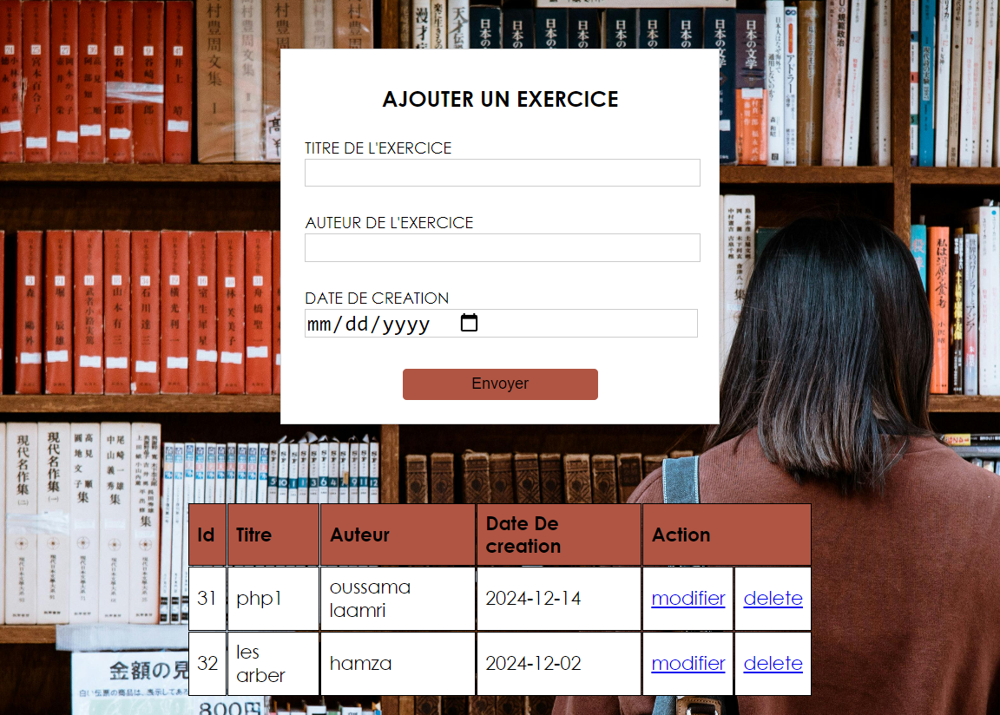

# Exercise Management System

A simple PHP-based system to manage exercises. This project allows users to **add**, **edit**, and **delete** exercises. It uses a MySQL database to store exercise data, including titles, authors, and creation dates.

## Features

- **Add an Exercise**: Users can add new exercises by providing the title, author, and creation date.
- **Edit an Exercise**: Existing exercises can be modified by updating their details.
- **Delete an Exercise**: Users can remove exercises from the database.
- **View Exercises**: A table displays all existing exercises with options to edit or delete them.

## Requirements

- PHP 7.0 or higher
- MySQL (or MariaDB) for the database
- A web server

## Project Demo

[](https://vimeo.com/1035388823/9d6853644f?share=copy)

## Installation

### 1. Clone the Repository

clone the repository to your local machine:

```bash
git clone https://github.com/your-username/exercise-management.git
```

### 2. Set Up the Database
Create a MySQL database and table for storing the exercise data. You can use the following SQL script to create the necessary table:

```sql
CREATE DATABASE exercise_management;

USE exercise_management;

CREATE TABLE exercice (
    id INT AUTO_INCREMENT PRIMARY KEY,
    titre VARCHAR(255) NOT NULL,
    auteur VARCHAR(255) NOT NULL,
    date_creation DATE NOT NULL
);
```

Update the database connection in the connection.php file with your database credentials

